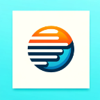
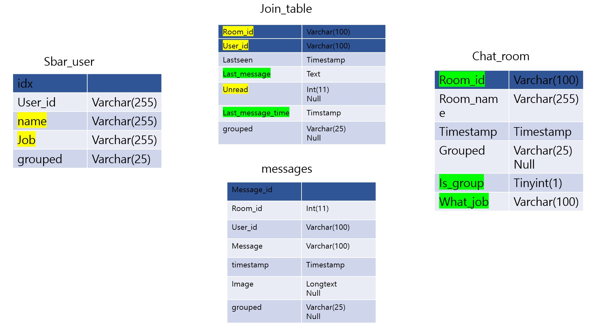

<h1>SBAR APP</h1>

 
 

<h2>Project Overview</h2>

다이어리와 채팅방 모바일 앱 구현

개발기간: 2024.2.14 ~ 2024.5.17 

 
 

<h2>배포 주소</h2>

공식 주소: https://sbar.nehub.info

Admin 계정 주소: https://sbar.nehub.info/admin/admin_login.html

 
 

<h2>시작 가이드</h2>
<h3>설치 방법</h3>

프로그래시브 웹앱(pwa)방식으로 구현되어, 스토어에서 앱 설치하는 방식이 아닌 웹 브라우저에서 홈 화면에 추가하는 방식입니다.

안드로이드 모바일: 홈 화면에 추가

PC: 오른쪽 위 설치 버튼

앱 설치를 권장드리나 웹 사이트에서도 작동합니다.

 

<h3>테스트 샘플 데이터</h3>

Private for Security

 

<h3>기능 소개</h3>

|                 | 안드로이드                   | iOS                      | 윈도우 데스크탑 PC           |
|-----------------|------------------------------|--------------------------|------------------------------|
| 앱 설치, 채팅사용         | O                            | O                        | O                            |
| 푸시 알림       | O                            | X                        | O                            |
| 자동 로그아웃   | X (로그아웃 버튼 눌러주세요) | X (로그아웃 버튼 눌러주세요) | O                            |

<ol>
  <li>메시지 보내기: 특정 그룹에 보내거나, 특정 사람에게 보낼 수 있음</li>
  <li>받은 메시지: 같은 그룹인 사람들끼리 묶인 방(socket.io)</li>
  <li>문의사항: 상담사(admin)와의 1대1방(socket.io)</li>
  <li>실시간 푸시 알림 구현(google FCM)</li>
</ol>
 
 

<h2>Stacks</h2>
<h3>Environment</h3>

 

<h3>Development</h3>

MariaDB and MYSQL is used with Cafe24 DB

 

<h3>Program Tools</h3>

Putty, Filezilla

 

<h3>Others</h3>

SessionStorage(for saving data temporarily and using in page)

PWA(manifest.json, service-worker.js etc) for making webapp

Nginx is used for replacing HTTP to HTTPS

 
 

<h2>유의사항</h2>

웹 호스팅은 AWS로 되어있고, DB만 Cafe24를 사용하고 있습니다.

처음에 Cafe24 웹호스팅을 썼다가 크기가 큰 node_modules 업로드로 인해 용량이 초과되어 사용이 불가해졌기 때문입니다.

로그아웃 버튼 누르지 않으면 token이 계속 살아있어서 알림이 계속 옵니다. 로그아웃 버튼을 누르면 token이 사라져서 알림이 안 옵니다.

 
 

<h2>ERD 다이어그램</h2>

